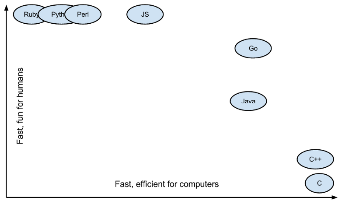
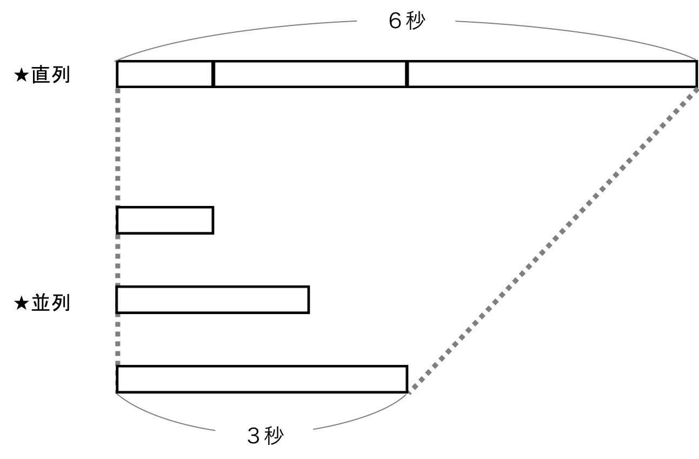
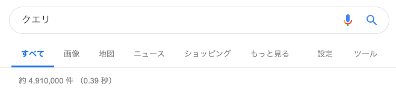
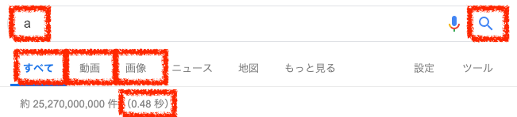
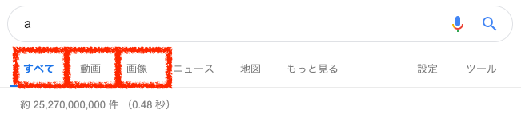
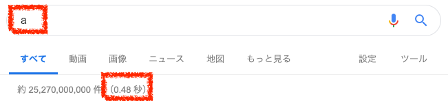
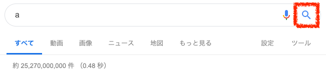
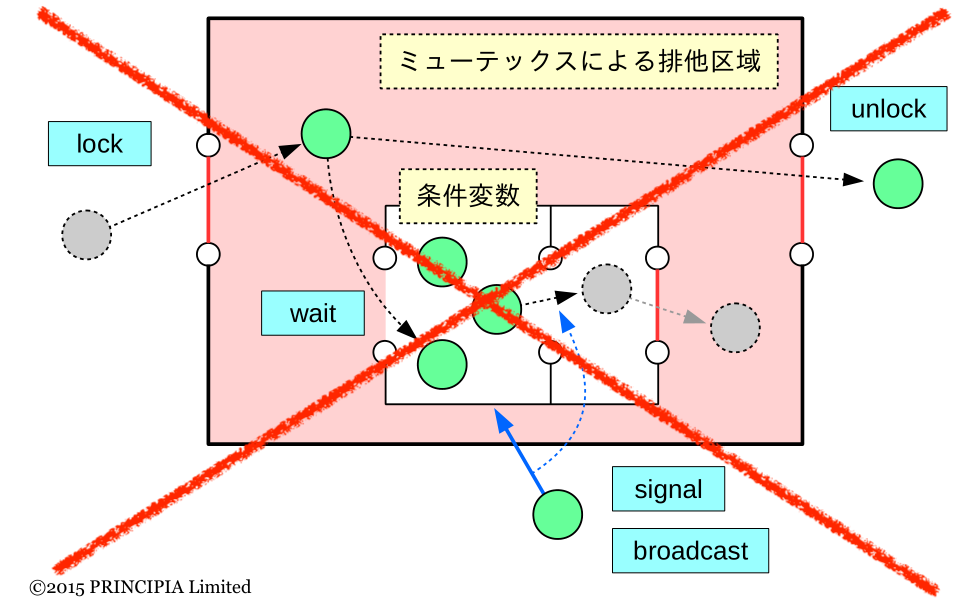
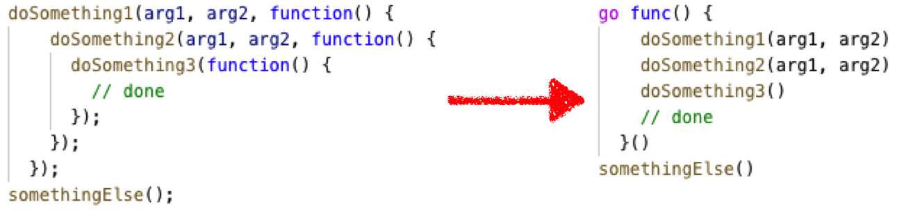

<!-- page_number: true -->

# Go言語で、Google検索もどきをつくる


---

# Goってなに？
- Googleがつくったすごい言語
- Python並に読みやすい、C並に速い

###### 参考：[Why should you learn Go? – Keval Patel – Medium](https://medium.com/@kevalpatel2106/why-should-you-learn-go-f607681fad65)

---

# なにがつくれる？
- Webアプリ
	- YouTubeはGoで書かれている
	- ==マイクロサービスもつくれる==　←今回はここ
- ソフトウェア
	- Windows, Linux, Macを同じコードで書ける
	- Android, iOSを同じコードで書ける
- PaaS
	- Docker, KubernetesはGoで書かれている
###### 参考：[go言語（golang）の特徴って？メリットとデメリットをまとめてみた](https://itpropartners.com/blog/10984/)

---

# やること
- ６秒の直列処理を３秒でやる　←前回


- ==Google検索もどきをつくる==　←今回はここ


---

# Google検索って何してる？


"クエリ"を、 ==複数の検索サーバ（Web、画像、動画、..）に投げて== 、
複数の検索結果を返してる

---

# 実装

---

# 実装するところ


---

# Web、画像、動画のニセ検索サーバ


---

# Web、画像、動画のニセ検索サーバ
==0~100ms待ってから検索時間を返す==

  ``` go
  var (
      Web   = fakeSearch("Web")
      Image = fakeSearch("Image")
      Video = fakeSearch("Video")
  )

  type Search func(query string) string
  
  func fakeSearch(kind string) Search {
      return func(query string) string {
          duration := rand.Intn(100)
          time.Sleep(time.Duration(duration) * time.Millisecond)
          return fmt.Sprintf("%s result for %q %d ms\n", kind, query, duration)
      }
  }
  ```

---

# ニセ検索サーバをたたく


---

# ニセ検索サーバをたたく
標準入力からクエリをいれて、検索結果と経過時間を表示する

  ``` go
  func main() {
      var query string
      fmt.Scanln(&query)

      rand.Seed(time.Now().UnixNano())
      start := time.Now()
      results := Google(query)
      elapsed := time.Since(start)

      fmt.Println(results)
      fmt.Println(elapsed)
  }
  ```

---

# Google検索


---

# Google検索 1.0
Web、画像、動画検索を==直列に呼び出し==、結果をつなげて返す
  ``` go
  func Google(query string) (results []string) {
      results = append(results, Web(query))
      results = append(results, Image(query))
      results = append(results, Video(query))
      return
  }
  ```

---

# 遅い

---

# Google検索 2.0
==並列に呼び出す==

  ``` go
  func Google(query string) (results []string) {
      c := make(chan string)
      go func() { c <- Web(query) }()
      go func() { c <- Image(query) }()
      go func() { c <- Video(query) }()

	  // 3回結果を受け取る まで待つ
      for i := 0; i < 3; i++ {
          result := <-c
          results = append(results, result)
      }
      return
  }
  ```

---

# 10ms以上待てない

---

# Google検索 2.1
10ms以上かかった検索サーバは無視して、残りの結果だけを返す
（==タイムアウト==）

  ``` go
  func Google(query string) (results []string) {
      c := make(chan string)
      go func() { c <- Web(query) }()
      go func() { c <- Image(query) }()
      go func() { c <- Video(query) }()
      
	  // 3回結果を受け取る or 10ms経つ まで待つ
      timeout := time.After(10 * time.Millisecond)
      for i := 0; i < 3; i++ {
          select {
          case result := <-c:
              results = append(results, result)
          case <-timeout:
              fmt.Println("timed out")
              return
          }
      }
      return
  }
  ```

---

# タイムアウトしないで

---

# Google検索 3.0
クエリを複数のレプリカサーバに投げ、一番早く返ってきた結果を使う
（==冗長化==）

  ``` go
  func Google(query string) (results []Result) {
      c := make(chan Result)
      go func() { c <- First(query, Webs...) } ()
      go func() { c <- First(query, Images...) } ()
      go func() { c <- First(query, Videos...) } ()
  ```

  ``` go
  func First(query string, replicas ...Search) Result {
      c := make(chan Result)
      searchReplica := func(i int) { c <- replicas[i](query) }
      for i := range replicas {
          go searchReplica(i)
      }
      return <-c
  }
  ```

---

# ここまでやっても
- ロック（セマフォやミューテックス）なし

- コールバックなし



---

# まとめ
Goだと、簡単にマイクロサービスがつくれる

  ``` go
  [Web 95 result for "a" 0 ms
   Image 72 result for "a" 0 ms
   Image 14 result for "a" 1 ms
  ]
  1.791093ms
  ```

---

# 参考サイト
- [Go Concurrency Patterns](https://talks.golang.org/2012/concurrency.slide#42)
- [上の日本語解説版](https://qiita.com/awakia/items/f8afa070c96d1c9a04c9)
  